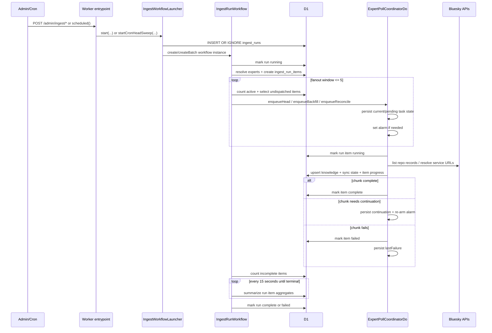
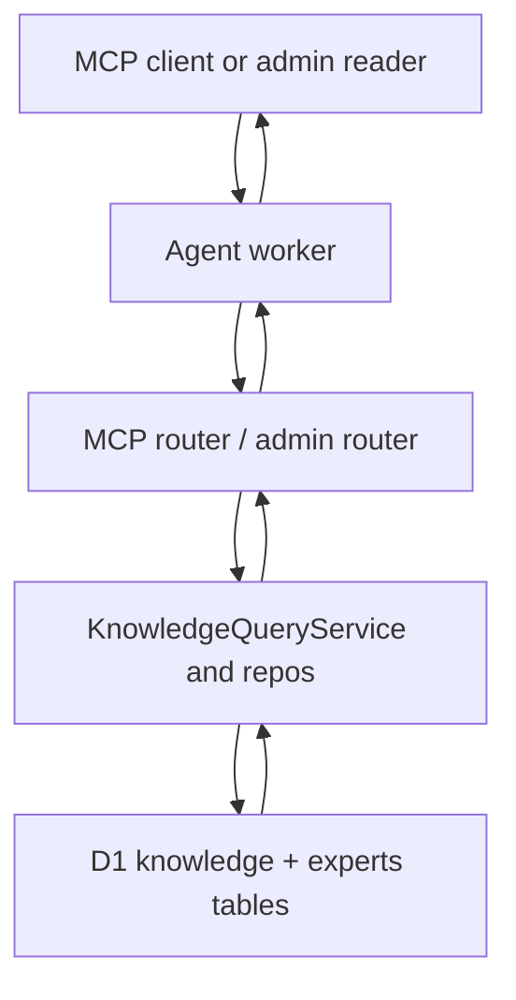
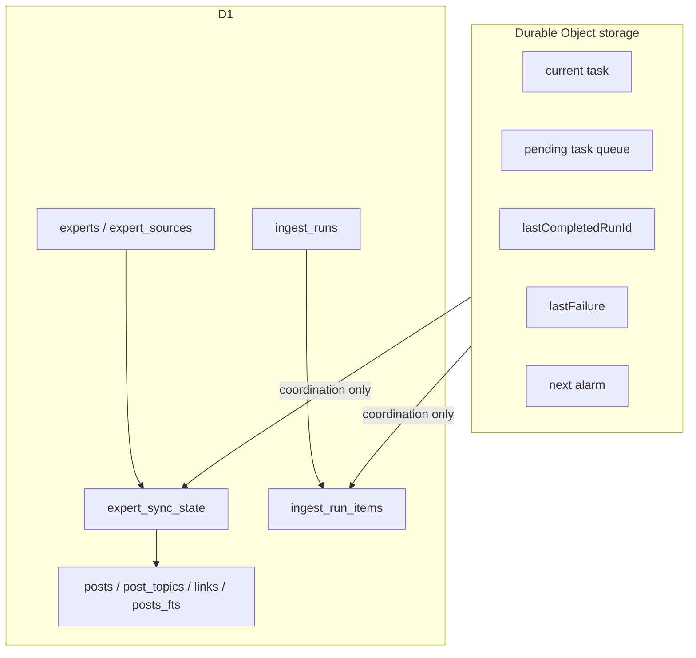

# Skygest Current System Architecture

**Date:** 2026-03-09
**Status:** Current live architecture reference

This document describes the current workflow-native ingest and query architecture as implemented in the active codebase.

It reflects the live runtime split between:

- the ingest worker in `src/worker/filter.ts`
- the agent worker in `src/worker/feed.ts`
- the run orchestrator in `src/ingest/IngestRunWorkflow.ts`
- the per-expert coordinator in `src/ingest/ExpertPollCoordinatorDo.ts`

It does not describe the removed lease-based coordinator as an active runtime path.

## System Overview

```mermaid
flowchart LR
    subgraph Operators["Operators and External Clients"]
      Admin["Admin operator"]
      McpClient["MCP client"]
      Cron["Cloudflare Cron"]
      Bluesky["Bluesky APIs"]
    end

    subgraph Workers["Cloudflare Workers"]
      Agent["Agent worker\nsrc/worker/feed.ts"]
      Ingest["Ingest worker\nsrc/worker/filter.ts"]
      Workflow["IngestRunWorkflow"]
      DO["ExpertPollCoordinatorDo\none per expert DID"]
    end

    subgraph Storage["Cloudflare Data Plane"]
      D1["D1\nexperts, sync state,\nknowledge, ingest runs"]
      DOStorage["DO storage\ncurrent task, pending queue,\nlast failure, alarms"]
    end

    Admin -->|POST /admin/ingest/*| Agent
    Admin -->|POST /admin/experts\nPOST /admin/ops/*| Agent
    McpClient -->|POST /mcp| Agent
    Cron -->|scheduled()| Ingest

    Agent -->|launch workflow| Workflow
    Ingest -->|launch deterministic cron workflow| Workflow
    Workflow -->|create/update run rows| D1
    Workflow -->|enqueue per-expert work| DO
    DO -->|load/save coordinator state| DOStorage
    DO -->|read/write sync state and run items| D1
    DO -->|fetch repo records / profiles| Bluesky
    Agent -->|query knowledge / experts| D1
```

## Runtime Boundaries

### 1. Agent worker

The agent worker is the public operator and query surface.

Responsibilities:

- `GET /health`
- `POST /mcp`
- `POST /admin/ingest/poll`
- `POST /admin/ingest/backfill`
- `POST /admin/ingest/reconcile`
- `GET /admin/ingest/runs/:runId`
- `GET /admin/ingest/runs/:runId/items`
- admin expert and staging ops routes

Source:

- `src/worker/feed.ts`
- `src/ingest/Router.ts`
- `src/admin/Router.ts`
- `src/mcp/Router.ts`

Authentication:

- operator auth is enforced before admin or MCP execution
- production mode expects Cloudflare Access
- staging mode may use the shared operator secret

### 2. Ingest worker

The ingest worker is intentionally narrow.

Responsibilities:

- `GET /health`
- scheduled cron entrypoint only

Source:

- `src/worker/filter.ts`

The cron path does not run ingest inline. It launches a workflow run through `IngestWorkflowLauncher`.

### 3. Workflow

`IngestRunWorkflow` is the durable run orchestrator.

Responsibilities:

- mark the run `running`
- resolve target experts
- create `ingest_run_items`
- dispatch work to expert DOs with a sliding fanout window of 5
- poll D1 until the run reaches terminal state
- compute the final run summary from aggregate SQL
- mark the run `complete` or `failed`

Source:

- `src/ingest/IngestRunWorkflow.ts`

### 4. Durable Object

`ExpertPollCoordinatorDo` is the per-expert coordination owner.

Responsibilities:

- own serialized execution for one expert DID
- dedupe or coalesce compatible work
- persist current task and pending queue in DO storage
- wake via alarm when work is pending
- execute one bounded chunk through `ExpertPollExecutor`
- update D1 run items and expert sync state
- re-arm itself if more work remains

Source:

- `src/ingest/ExpertPollCoordinatorDo.ts`
- `src/ingest/ExpertPollCoordinatorState.ts`

### 5. Executor

`ExpertPollExecutor` owns the single-expert poll logic.

Responsibilities:

- fetch post windows from Bluesky
- convert repo records into ingest batches
- write knowledge rows to D1
- reconcile deletes
- update `expert_sync_state`

Source:

- `src/ingest/ExpertPollExecutor.ts`
- `src/filter/FilterWorker.ts`

## Ingest Control Flow



## Query Flow



This path is read-oriented and separate from workflow orchestration. Query traffic does not wake expert DOs.

## Storage Ownership



### Durable Object storage

The DO owns transient coordination state that must survive eviction:

- current task
- pending tasks
- last completed run id
- last failure envelope
- alarm scheduling

This state is not the reporting source of truth.

### D1

D1 is the durable, queryable system state.

Current functional ownership:

- `experts`
  - expert registry and activation state
- `expert_sync_state`
  - per-expert ingest cursor and completion state
- `ingest_runs`
  - workflow-visible run lifecycle
- `ingest_run_items`
  - per-expert execution status and counters
- `posts`, `post_topics`, `links`, `posts_fts`
  - knowledge/query surface

## Current Semantics

### Workflow instance identity

Manual runs:

- use a generated UUID run id

Cron head sweeps:

- use a deterministic id shaped like `head-sweep:{slotIso}`
- duplicate cron slots collapse at the D1 run row before a workflow is relaunched

### Per-run fanout

Current workflow fanout:

- at most 5 active experts per workflow run
- determined by D1 counts, not by in-memory workflow state

### Per-expert chunking

Current execution chunk limits:

- head: 2 pages
- backfill: 2 pages / 200 posts per alarm
- reconcile recent: 2 pages / 200 posts
- reconcile deep: 2 pages / 200 posts per alarm

### Priority behavior

Head work is higher priority than bulk work, but not mid-chunk preemptive.

Meaning:

- a running backfill or reconcile chunk is allowed to finish
- the next claimed task prefers head work over remaining bulk work

## Current Worker Bindings

Both workers currently bind:

- `DB`
- `INGEST_RUN_WORKFLOW`
- `EXPERT_POLL_COORDINATOR`

Wrangler config:

- `wrangler.toml`
- `wrangler.agent.toml`

The ingest worker owns cron. The agent worker owns admin and MCP traffic.

## Effect Runtime Shape

The active architecture uses Effect layers as the composition boundary around each Cloudflare runtime surface.

Current pattern:

- one managed runtime per request, workflow instance, or DO instance
- shared service graph assembled in `makeWorkflowIngestLayer`
- repos and services modeled as `Context.Tag` services
- schema-backed decode and error envelopes at storage and boundary edges

Key sources:

- `src/platform/EffectRuntime.ts`
- `src/ingest/Router.ts`
- `src/admin/Router.ts`
- `src/ingest/IngestRunWorkflow.ts`
- `src/ingest/ExpertPollCoordinatorDo.ts`

## What Is Not On The Active Path

The following are not part of the current runtime architecture:

- D1 lease-based poll coordination
- synchronous request-bound backfill or reconcile execution
- queue-based poll execution
- the removed feed/generator/postprocess stack

## Operational Invariants

These are the main invariants the current system is built around:

1. Workflows own run orchestration and operator-visible run lifecycle.
2. Durable Objects own per-expert serialization and continuation.
3. D1 is the queryable source of truth for runs, items, sync state, and knowledge.
4. Query traffic reads D1 directly and does not participate in ingest coordination.
5. Cron creates workflows, not direct poll execution.
6. No active path depends on D1 row leases for coordination.

## File Map

Primary runtime files:

- `src/worker/feed.ts`
- `src/worker/filter.ts`
- `src/ingest/Router.ts`
- `src/ingest/IngestWorkflowLauncher.ts`
- `src/ingest/IngestRunWorkflow.ts`
- `src/ingest/ExpertPollCoordinatorDo.ts`
- `src/ingest/ExpertPollExecutor.ts`
- `src/filter/FilterWorker.ts`
- `src/mcp/Router.ts`
- `src/services/d1/IngestRunsRepoD1.ts`
- `src/services/d1/IngestRunItemsRepoD1.ts`
- `src/services/d1/ExpertSyncStateRepoD1.ts`
- `src/services/d1/KnowledgeRepoD1.ts`
- `src/db/migrations.ts`
