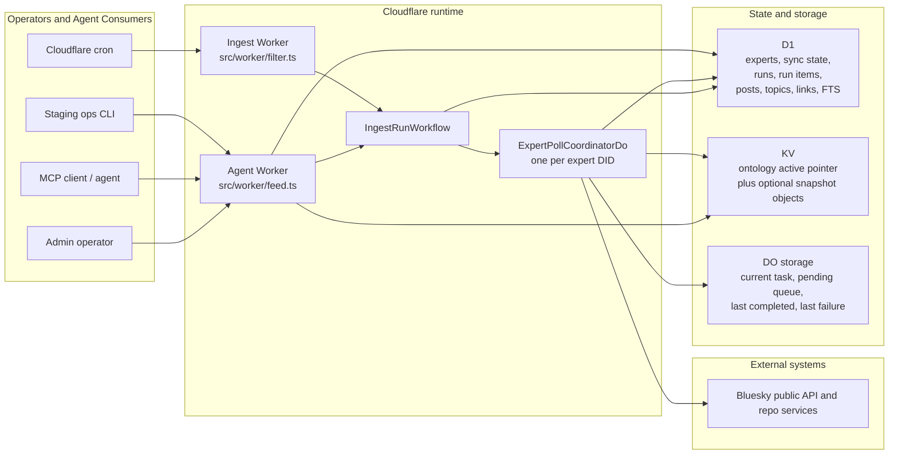

# Skygest Current Implementation Architecture

**Date:** 2026-03-12  
**Scope:** Current codebase plus remote state that could be verified from the configured Cloudflare account  
**Primary goal:** Preserve an engineering understanding of what Skygest currently is, what it already supports, and what is only implied or planned

## Executive Summary

## Historical Addendum (2026-04-11)

A follow-up Cloudflare account check on 2026-04-11 changed the live-state
picture in one important way:

- the account still only has the staging split workers
  (`skygest-bi-agent-staging`, `skygest-bi-ingest-staging`,
  `skygest-resolver-staging`)
- no non-staging `skygest-bi-agent` or `skygest-bi-ingest` worker exists in the
  current account
- the only live Skygest coordinator namespace is
  `skygest-bi-ingest-staging_ExpertPollCoordinatorDo`
- the staging agent worker no longer binds `EXPERT_POLL_COORDINATOR`

That means the "split coordinator namespaces in staging" caveat captured below
is now historical. The current account state is simpler: the ingest worker owns
the coordinator namespace directly, and the agent worker does not have its own
live coordinator namespace.

Skygest is currently an operator-managed, Cloudflare-native ingestion and retrieval system for a domain-specific Bluesky knowledge base.

Today it does four concrete things:

1. Tracks a curated set of expert Bluesky accounts.
2. Polls those experts' repos and normalizes relevant posts into query-ready D1 tables.
3. Classifies matched posts against a structured energy ontology using deterministic term, hashtag, and domain signals.
4. Exposes the stored knowledge through admin APIs and a read-only MCP server for agent consumption.

The system is not currently a public application surface. The active runtime is an operator/API backend made of:

- one public "agent" Worker for admin and MCP traffic
- one narrow "ingest" Worker for cron-triggered orchestration
- one Workflow class for run orchestration
- one Durable Object class for per-expert serialized execution
- D1 as the durable/queryable state plane
- KV as an ontology catalog hook with local file fallback

The strongest product intent visible in the code is: build a reliable, ontology-aware Bluesky intelligence layer for a specific domain, currently `energy`, and expose it first to operators and agents before any broader end-user surface.

## What Was Verified Remotely

This document is grounded in both source code and read-only Cloudflare inspection performed on **2026-03-12**.

### Verified staging deployment state

Confirmed from `wrangler deployments list`:

- `skygest-bi-agent-staging` has recent deployments, with the latest observed deployment created at **2026-03-12T10:34:02.624Z**
- `skygest-bi-ingest-staging` has recent deployments, with the latest observed deployment created at **2026-03-12T10:11:20.025Z**
- `https://skygest-bi-agent-staging.kokokessy.workers.dev/health` returned `200 ok`
- `https://skygest-bi-ingest-staging.kokokessy.workers.dev/health` returned `200 ok`

Not confirmed remotely:

- default worker names `skygest-bi-agent` and `skygest-bi-ingest` were **not found** on the current Cloudflare account
- as a result, this document can confirm **staging is deployed**, but cannot claim a separate non-staging deployment is live on this account

Important deployment caveat confirmed from `wrangler versions view --json`:

- the staging `agent` worker and staging `ingest` worker share the same D1 database and KV namespace
- on 2026-03-12 they did **not** share the same `EXPERT_POLL_COORDINATOR` Durable Object namespace
- staging config disables cron triggers for the ingest worker
- observed staging namespace IDs:
  - agent worker: `004eb27c42204a7c858d73ddcc396f03`
  - ingest worker: `aaca72ee1b1f41f993ce5f592e748c23`

Inference from that deployment state:

- the codebase is architected as if there is one logical per-expert coordinator layer
- live staging on 2026-03-12 split that coordinator state by worker deployment
- admin-triggered runs and cron-triggered runs therefore do **not** share the same live Durable Object state in staging
- because staging cron is disabled and all observed staging runs were operator-triggered, this mismatch is a real deployment caveat but not one that appears to be exercised by scheduled traffic today

Re-check on 2026-04-11:

- the staging agent worker no longer exposes an `EXPERT_POLL_COORDINATOR`
  binding in its deployed version metadata
- the only live coordinator namespace now belongs to
  `skygest-bi-ingest-staging`
- no `ExpertPollCoordinatorDoIsolated` namespace exists in the account

### Verified staging D1 state

Confirmed from remote D1 queries against `skygest-staging` on **2026-03-12**:

- `experts`: 152 total rows
- active experts: 150
- `expert_sync_state`: 150 rows
- `posts`: 14,053 `active`, 4,116 `deleted`
- `post_topics`: 18,103 rows
- `links`: 8,697 rows
- `ingest_runs`: 30 rows
- active post timespan: **2022-01-19T19:07:43.000Z** to **2026-03-12T01:43:03.000Z**

Run-shape observations from the same remote data:

- all 30 observed runs are `head-sweep` runs
- all 30 observed runs were triggered by `admin`
- observed run statuses: 18 `complete`, 12 `failed`
- the two most recent runs both targeted 150 experts and finished with 149 succeeded / 1 failed

### Verified staging ontology state

Confirmed from KV:

- key `ontology:energy:active` exists and points to snapshot version `0.3.0-c0e0f896b6f2`
- no `ontology:energy:snapshots:*` keys were present in the namespace at inspection time

Inference from runtime code plus that KV state:

- the runtime will attempt to follow the active KV pointer first
- because the pointed snapshot object is not present, the live code will fall back to the checked-in local file `config/ontology/energy-snapshot.json`
- that checked-in file is also version `0.3.0-c0e0f896b6f2`

So the **effective ontology behavior is most likely coming from the checked-in snapshot file**, not a fully seeded KV snapshot catalog.

## System In One Picture

## What You Have Built

At a product level, Skygest is currently a **domain-scoped Bluesky knowledge ingestion backend**.

More concretely:

- experts are the primary tracked entities
- posts are only retained if they match the ontology
- classification is deterministic and explainable, not embedding-based
- ingest is designed for resumability and per-expert serialization
- retrieval is designed for agents and operator tooling, not a public UI

The system behaves more like a **knowledge pipeline plus query service** than a social feed product.

## Runtime Architecture

### 1. Agent Worker

Source: `src/worker/feed.ts`

This is the main API surface.

Responsibilities:

- health check
- MCP endpoint
- admin ingest control
- admin expert registry
- staging-only operational endpoints

Implemented fetch routes:

- `GET /health`
- `POST /mcp`
- `POST /admin/ingest/poll`
- `POST /admin/ingest/backfill`
- `POST /admin/ingest/reconcile`
- `POST /admin/ingest/repair`
- `GET /admin/ingest/runs/:runId`
- `GET /admin/ingest/runs/:runId/items`
- `POST /admin/experts`
- `GET /admin/experts`
- `POST /admin/experts/:did/activate`
- `POST /admin/ops/migrate`
- `POST /admin/ops/bootstrap-experts`
- `POST /admin/ops/load-smoke-fixture`

Everything else returns `404`.

### 2. Ingest Worker

Source: `src/worker/filter.ts`

This worker is intentionally narrow.

Responsibilities:

- `GET /health`
- `scheduled()` cron entrypoint

It does **not** execute ingest inline during the cron callback. It uses `IngestWorkflowLauncher` to enqueue a Workflow run.

### 3. Workflow Launcher and Workflow

Sources:

- `src/ingest/IngestWorkflowLauncher.ts`
- `src/ingest/IngestRunWorkflow.ts`

This layer owns run-level orchestration.

Key behavior:

- manual admin-triggered runs get a generated UUID `runId`
- cron head sweeps get a deterministic `runId` shaped like `head-sweep:{slotIso}`
- D1 is updated before and during execution so run state is always queryable
- the workflow creates one `ingest_run_item` per target expert
- dispatch is limited to a **fanout window of 5 active experts per run**
- the workflow repeatedly polls D1 until all items are terminal
- final run counters are computed from aggregate SQL, not in-memory bookkeeping

Current run phases:

- `queued`
- `preparing`
- `dispatching`
- `finalizing`
- `complete`
- `failed`

### 4. Per-Expert Durable Object Coordinator

Sources:

- `src/ingest/ExpertPollCoordinatorDo.ts`
- `src/ingest/ExpertPollCoordinatorState.ts`

This is the system's serialization boundary.

There is one coordinator Durable Object per expert DID.

Its job is to:

- ensure only one ingest chunk runs for an expert at a time
- persist pending work across Worker/DO restarts or evictions
- coalesce repeated head work
- dedupe repeated backfill/reconcile requests for the same run
- resume long-running backfill/reconcile work via alarms and continuation state

Stored DO state is coordination-only:

- `current`
- `pending`
- `lastCompletedRunId`
- `lastFailure`

This is not treated as the reporting source of truth. D1 remains the system-of-record for run/item status.

Important live-staging nuance:

- the source architecture assumes a single logical coordinator layer
- the verified staging deployment currently binds the agent and ingest workers to different Durable Object namespaces
- so the intended per-expert serialization guarantee currently holds **within each worker's namespace**, but not necessarily across admin-triggered and cron-triggered execution paths in staging

### 5. Expert Poll Executor

Source: `src/ingest/ExpertPollExecutor.ts`

This is the single-expert ingest engine.

It performs:

- repo record listing from the expert's PDS
- head polling
- bounded backfill
- reconcile scans for deletes
- sync-state updates
- knowledge post writes and deletes

It uses:

- `RepoRecordsClient` to resolve and cache the expert's PDS endpoint
- `ExpertSyncStateRepo` to persist cursors and last-error information
- `KnowledgeRepo` to write posts/topics/links
- `OntologyCatalog` to classify posts

### 6. Filter Worker Logic

Source: `src/filter/FilterWorker.ts`

This is the normalization/classification stage used by ingest.

For each record:

- decode a slim Bluesky post shape
- extract text, external link metadata, hashtags, and link domains
- classify the post against the ontology
- drop it entirely if it matches no topics
- otherwise store:
  - post
  - topic matches
  - extracted links
  - match provenance

That last point matters: Skygest is not storing the full firehose and classifying later. It is storing only the ontology-matched slice.

## Ingest Modes And Their Semantics

Skygest currently supports three ingest modes in code.

### Head sweep

Purpose:

- fetch only newer posts since the stored head marker

Behavior:

- uses `expert_sync_state.headUri` as the stop point
- reconciles recent deletes for fetched windows
- updates head markers and last-sync timestamps
- always completes in one logical run item, though the worker chunk is still bounded

### Backfill

Purpose:

- walk older history for an expert

Behavior:

- uses and updates `expert_sync_state.backfillCursor`
- supports `maxPosts` and `maxAgeDays`
- continues across DO alarms until complete
- marks `backfillStatus` as `running`, `complete`, or `failed`

Important current-state note:

- remote staging data showed **no backfill runs recorded yet**
- this mode is implemented and tested, but not currently evidenced as active in staging history

### Reconcile

Purpose:

- scan remote history and mark locally stored posts deleted when they no longer exist remotely

Behavior:

- supports `depth: recent | deep`
- recent and deep differ mainly in age/page limits
- stores delete events by marking posts as `deleted`

Important current-state note:

- remote staging data showed **no reconcile runs recorded yet**
- this mode is implemented and tested, but not yet evidenced as active in staging history

### Current chunk limits

Configured in `ExpertPollCoordinatorDo` and `ExpertPollExecutor`:

- head: 2 pages
- backfill: 2 pages / 200 posts per chunk
- reconcile recent: 2 pages / 200 posts per chunk
- reconcile deep: 2 pages / 200 posts per chunk

## Query And Retrieval Architecture

### Query service

Source: `src/services/KnowledgeQueryService.ts`

This service is the read facade over D1 plus ontology expansion logic.

Supported queries:

- full-text post search with optional topic filter
- recent post listing with optional expert/topic filters
- extracted link listing with optional link-domain/topic filters
- expert listing
- topic listing
- topic lookup
- topic expansion
- per-post topic explanation

### MCP server

Sources:

- `src/mcp/Router.ts`
- `src/mcp/Toolkit.ts`

The MCP server is read-only and currently exposes eight tools:

- `search_posts`
- `get_recent_posts`
- `get_post_links`
- `list_experts`
- `list_topics`
- `get_topic`
- `expand_topics`
- `explain_post_topics`

This makes MCP the current primary machine-consumable product surface.

## Ontology Architecture

### Effective ontology shape

Sources:

- `config/ontology/energy-snapshot.json`
- `src/services/OntologyCatalog.ts`
- `src/ontology/buildSnapshot.ts`
- `tests/ontology.test.ts`
- `tests/ontology-snapshot.test.ts`

Current checked-in ontology characteristics:

- ontology version: `0.3.0`
- snapshot version: `0.3.0-c0e0f896b6f2`
- canonical topics: 30
- concepts: 92

### Matching model

Skygest currently uses a deterministic matcher with three signal types:

- text terms
- hashtags
- link domains

Signal strength is intentionally ranked:

- term match
- hashtag match
- domain match

The topic match provenance stored on each post includes:

- `match_signal`
- `match_value`
- `match_score`
- `ontology_version`
- `matcher_version`

This is important because it means topic assignment is already explainable and auditable.

### Catalog loading behavior

At runtime, `OntologyCatalog` tries to load:

1. `ontology:energy:active` from KV
2. `ontology:energy:snapshots:<version>` from KV
3. checked-in local snapshot file if KV is missing or invalid

As verified on 2026-03-12, staging appears to be operating on step 3 in practice.

## Authentication And Access Model

Sources:

- `src/worker/operatorAuth.ts`
- `src/auth/AuthService.ts`
- `wrangler.toml`
- `wrangler.agent.toml`

Two auth modes exist:

### Access mode

Used by default config.

Behavior:

- expects Cloudflare Access JWT in `cf-access-jwt-assertion`
- validates issuer against `ACCESS_TEAM_DOMAIN`
- validates audience against `ACCESS_AUD`

### Shared-secret mode

Used by `env.staging`.

Behavior:

- expects `x-skygest-operator-secret`
- is intended for staging/operator workflows
- unlocks `/admin/ops/*` routes that otherwise return `404`

Current scope model:

- `experts:write` for expert mutations
- `ops:refresh` for ingest and staging ops mutations

## Persistent Data Model

### D1 tables actively used

Source of truth: `src/db/migrations.ts`

Actively used tables:

- `experts`
  - expert registry, metadata, active flag, shard assignment, last sync time
- `expert_sync_state`
  - per-expert cursors, PDS resolution cache, last-error state, backfill status
- `ingest_runs`
  - workflow-visible run lifecycle and aggregate counters
- `ingest_run_items`
  - per-expert execution state and counters
- `posts`
  - stored knowledge rows with `active` / `deleted` status
- `post_topics`
  - topic matches plus provenance
- `links`
  - extracted link records
- `posts_fts`
  - full-text search index
- `_migrations`
  - migration bookkeeping

### D1 tables present but not central to the current runtime

- `expert_sources`
  - still created, but no major active service path depends on it
- `ingest_leases`
  - removed from the active model and explicitly dropped by migration 4

### Durable Object state

Durable Object storage holds only coordination state:

- current task
- pending queue
- completion/failure markers
- alarm scheduling

### KV state

KV is currently used for ontology catalog selection, not operational ingest state.

There is also a dormant candidate-session KV path in `src/services/kv/CandidateSessionsKv.ts`, but it is not wired into the active runtime and expects a binding not present in current env definitions.

## Operational Tooling

### Checked-in scripts

From `package.json` and `src/scripts/*`:

- `bootstrap:experts`
  - initializes a local SQLite DB and inserts the checked-in expert seed set
- `build:ontology-snapshot`
  - rebuilds `config/ontology/energy-snapshot.json` from ontology source artifacts
- `seed:ontology-kv`
  - uploads ontology snapshot artifacts to KV
- `ops`
  - Bun CLI wrapper for deploy and staging flows

### Ops CLI capabilities

Sources:

- `src/ops/Cli.ts`
- `src/ops/StagingOperatorClient.ts`
- `tests/ops-cli.test.ts`

Supported commands:

- deploy workers with Wrangler
- prepare staging
  - migrate D1
  - bootstrap experts
  - run a one-expert ingest
  - load deterministic smoke fixture data
- run staging smoke checks
- repair ingest state

This is a strong sign that staging is treated as the active operational environment today.

## Current Verified Capabilities

This is the simplest direct answer to "what does the existing architecture support?"

### It already supports

- curated expert registry management
- per-expert activation/deactivation
- cron and manual head sweeps
- manual backfill and reconcile requests
- durable, queryable ingest run tracking
- recovery/repair of stale ingest state
- deterministic ontology-based post classification
- explainable topic provenance
- full-text and metadata-backed retrieval from D1
- MCP-based agent access to the knowledge base
- staging bootstrap and smoke-test flows

### It does not currently appear to support as an active product surface

- a public end-user web UI
- feed generation or post ranking output
- queue-based ingest execution
- semantic retrieval fallback using embeddings or Workers AI
- storage of unmatched posts for later reprocessing
- multi-domain operation beyond the checked-in `energy` domain

## Architectural Intentions Visible In The Code

These points are partly inference, but they are strongly supported by naming, module boundaries, and the surrounding scripts/tests.

### 1. Operator-first before user-facing product

The live surfaces are admin routes, MCP, staging ops, and smoke tooling. That implies the current phase is backend/operator hardening rather than public UX.

### 2. Strong preference for resumable, deterministic ingest

The Workflow + Durable Object split, detailed run/item tables, repair service, and chunk continuation model all show a design optimized for safe recovery and observability, not just maximum throughput.

### 3. Ontology-centered retrieval is the core differentiator

Skygest is not just collecting posts. It is building a topic-aware knowledge base whose retrieval quality depends on a maintained domain ontology.

### 4. Agents are a first-class consumer

The MCP surface is not incidental. The read-only toolkit is deliberate and sufficiently broad that an agent can already inspect experts, retrieve posts/links, browse the ontology, and explain topic matches.

### 5. Runtime ontology versioning is intended, but not fully operationalized

The code clearly intends to support versioned ontology snapshots in KV. The currently observed staging namespace suggests that mechanism is only partially seeded, so the fallback file is doing the practical work today.

## What Is Not On The Active Path

The following are either removed, dormant, or not wired into the verified runtime:

- lease-based ingest coordination in D1
- the old feed/generator/postprocess stack
- candidate-session KV caching
- any public browse/feed application
- non-energy domain packs
- vector or LLM-backed relevance fallback

## Bottom Line

Skygest today is a **Cloudflare-native, ontology-driven Bluesky knowledge ingestion backend** with:

- strong operator controls
- durable run tracking
- per-expert serialized polling
- D1-backed searchable storage
- read-only MCP retrieval for agents

The current deployed reality that could be verified is **staging-first**, not clearly separate production.

The biggest gap between intended and verified live behavior is that **staging currently splits per-expert Durable Object coordination between the two workers** even though the code is written as if they share one coordinator layer.

The current architecture is already strong enough to support:

- reliable expert ingestion
- historical and incremental synchronization
- topic-aware knowledge retrieval
- debugging and repair of ingest failures
- ontology-aware agent queries

What it is **not** yet is a finished end-user application. It is the knowledge backbone and operator plane that such an application would sit on top of.
