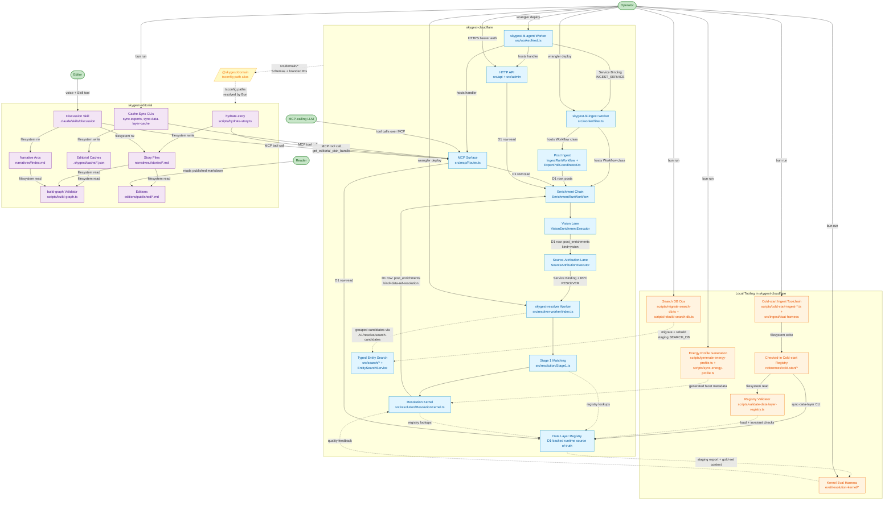

# Skygest System Context

This document maps the current top-level subsystems across `skygest-cloudflare` and `skygest-editorial` after the April 14, 2026 registry, lookup, ingest, and search-infra follow-ons. The live resolver path is still `Stage 1 matching -> Resolution Kernel` inside the standalone `skygest-resolver` Worker, and the older "runtime Stage 2 plus Stage 3 workflow" story is still obsolete. Two caveats from the previous snapshot have now changed: editor-facing data-ref lookup is shipped on the MCP surface, and series-backed dataset and agent narrowing are no longer just scaffolded registry behavior. A separate typed entity-search layer now has real staging infrastructure through `SEARCH_DB` plus migrate/rebuild scripts, but it is still not a production-wide contract because production provisioning is deferred.

Effect vocabulary is still load-bearing here: every subsystem name is a Tag, a Workflow class, a Worker name, or a script you can grep for.

## Diagram

## Subsystems

### skygest-cloudflare

**skygest-bi-ingest Worker** (`wrangler.toml`, `src/worker/filter.ts`). The backend Worker that hosts `IngestRunWorkflow`, `EnrichmentRunWorkflow`, the `ExpertPollCoordinatorDo` Durable Object, and the cron sweep that launches ingest. It owns the write-heavy side of the system and the bindings the async workflows need. *Shipped.*

**skygest-bi-agent Worker** (`wrangler.agent.toml`, `src/worker/feed.ts`). The frontend Worker that serves the public/admin HTTP API and the MCP endpoint. It still uses `INGEST_SERVICE` for backend-owned write paths, while keeping its own direct read/admin bindings for the routes declared in `src/worker/feed.ts`. *Shipped.*

**Post Ingest** (`src/ingest/`). Polls tracked experts, writes new posts to D1, and launches enrichment for new material. Exposes `IngestWorkflowLauncher` and `IngestRunWorkflow`; depends on the expert repos, sync-state repos, and Bluesky/Twitter client layers. *Shipped.*

**Enrichment Chain** (`src/enrichment/`). Runs the lane DAG over each post via `EnrichmentRunWorkflow` and `EnrichmentPlanner`. The important current behavior is that, when `ENABLE_DATA_REF_RESOLUTION` is on, the workflow now calls the resolver after source attribution and persists a `data-ref-resolution` enrichment row containing `stage1` plus `kernel` output. *Shipped.*

**Vision Lane** (`src/enrichment/vision/`). Calls Gemini to extract chart titles, visible URLs, source lines, logo text, and other media cues. Exposes `VisionEnrichmentExecutor` layered on `GeminiVisionServiceLive`. *Shipped.*

**Source-Attribution Lane** (`src/source/`). Turns vision output plus link context into ranked provider hints against the legacy provider registry. Exposes `SourceAttributionExecutor` layered on `SourceAttributionMatcher` and `ProviderRegistry`. This lane still matters because it feeds the resolver, even though the registry it uses is intentionally frozen for new providers. *Shipped; frozen for new providers.*

**skygest-resolver Worker** (`wrangler.resolver.toml`, `src/resolver-worker/index.ts`). Standalone Worker that exposes the resolver over HTTP and over the `RESOLVER` Service Binding through `ResolverEntrypoint`. It is now part of the shipped runtime, not a planned deployment slice. `src/resolver/Client.ts` is the calling seam used by the ingest and agent workers. *Shipped.*

**Stage 1 Matching** (`src/resolution/Stage1.ts`, `src/resolution/Stage1Resolver.ts`). The deterministic first pass that turns post context, vision output, and source-attribution output into direct matches and typed residuals. It still matters, but it is now an internal step inside the resolver stack rather than the whole runtime story. *Shipped.*

**Resolution Kernel** (`src/resolution/ResolutionKernel.ts`, `src/domain/resolutionKernel.ts`). The authoritative resolver output. It takes Stage 1 input plus structured evidence bundles, binds against the D1-backed registry, and emits `ResolutionOutcome[]` with statuses such as `Resolved`, `Ambiguous`, `Underspecified`, `Conflicted`, `OutOfRegistry`, and `NoMatch`. The old runtime Stage 2 path has been removed; the kernel is the live replacement. *Shipped.*

**Data Layer Registry (D1)** (`variables`, `series`, `distributions`, `datasets`, `agents`, `catalogs`, `catalog_records`, `data_services`, `dataset_series`). The runtime source of truth for resolver lookups. It is loaded into a prepared lookup contract at Worker cold start and is fed from the checked-in cold-start tree via `scripts/sync-data-layer.ts`. The earlier `SKY-317` shelf-completeness gap is now closed: `Series.datasetId` is wired through schema generation, storage, registry preparation, and the agent-variable shelf, so series-backed dataset and agent narrowing are real. The registry contract now also carries tolerant distribution-URL lookup, dataset landing-page lookup, and the publisher-aware dataset matching that Stage 1 relies on. Remaining work is about resolver quality and coverage, not missing shelf plumbing. *Shipped; quality work continues.*

**Cold-start Ingest Toolchain** (`scripts/cold-start-ingest-*.ts`, `src/ingest/dcat-harness/`). Local Effect scripts that fetch provider catalog surfaces and project them into checked-in Skygest registry data. The shared harness owns merge rules, slug stability, validation, graph construction, and atomic writes. It now also preserves or synthesizes DCAT `DatasetSeries` publication groupings so the catalog can distinguish publication-series membership from measurement-side `Series`. *Shipped.*

**Checked-in Cold-start Registry** (`references/cold-start/`). Human-reviewed JSON seed state for the data layer. Runtime does not read it directly in production anymore, but it remains the audited source that feeds the D1 registry, local tests, and eval fixtures. *Shipped.*

**Energy Profile Generation** (`scripts/generate-energy-profile.ts`, `scripts/sync-energy-profile.ts`, `src/domain/generated/energyVariableProfile.ts`). The generated profile is now the canonical runtime source of facet metadata for the resolution kernel and partial-variable algebra. This is the bridge between the checked-in structural manifest and the code the resolver actually uses at runtime. *Shipped.*

**On-demand Registry Validator** (`scripts/validate-data-layer-registry.ts`). Loads the checked-in cold-start tree end to end and runs the full-catalog invariants that were moved out of the fast unit suite. It is now the load-bearing guardrail for whole-registry decode, referential integrity, and series-backed shelf checks before or alongside catalog-heavy merges. *Shipped.*

**Search DB Migration + Rebuild Tooling** (`scripts/migrate-search-db.ts`, `scripts/rebuild-search-db.ts`, `scripts/rebuild-entity-search-index.ts`). Operator scripts that apply the typed-search schema to the staging `SEARCH_DB` and rebuild the search read model from the canonical data-layer source. This is what turns typed search from a code-only seam into a staged service surface. Production provisioning is still deferred, so the search path remains environment-scoped rather than universal. *Shipped for staging ops; production expansion deferred.*

**Kernel Eval Harness** (`eval/resolution-kernel/`). The current resolver-quality loop. It runs expected outcomes against the shipped kernel contract and writes diagnostic runs under `eval/resolution-kernel/runs/<timestamp>/`. The important architectural point is that this is now the quality loop worth watching, not the old Stage 1-only eval story. *Shipped; results still show real accuracy work remaining.*

**Typed Entity Search Foundation** (`src/search/`, `src/domain/entitySearch.ts`, `src/services/EntitySearchService.ts`, `scripts/rebuild-entity-search-index.ts`). Projects Agents, Datasets, Distributions, Series, and Variables into a rebuildable search read model and exposes grouped candidate search through `/v1/resolve/search-candidates`. The staging resolver and agent configs now declare `SEARCH_DB`, and the operator scripts can migrate and rebuild it. Production still omits the binding, so this should be described as staged infrastructure rather than a production-wide reader/editor contract. *Shipped in staging; production-deferred.*

**MCP Surface** (`src/mcp/Router.ts`, `src/mcp/Toolkit.ts`). Exposes the tool surface used by the discussion workflow and other operator/editor flows. The dedicated lookup tools `resolve_data_ref` and `find_candidates_by_data_ref` are now part of the shipped read surface, and the reverse-lookup tool reads from a citation model refreshed when `data-ref-resolution` enrichments are saved. *Shipped.*

**HTTP API Surface** (`src/api/Router.ts`, `src/admin/Router.ts`, plus backend routes mounted under `/admin`). Public reads plus operator writes. Authorized by bearer token on the admin side. *Shipped.*

### skygest-editorial

**hydrate-story** (`scripts/hydrate-story.ts` -> `src/narrative/HydrateStory.ts`). Pulls an `EditorialPickBundle` from staging and writes or refreshes a story scaffold plus per-post annotations. The core scaffold path is shipped; projecting resolver-backed `dataRefs` into story frontmatter is still the open `SKY-242` step. *Shipped core, data-ref projection planned.*

**Cache Sync CLIs** (`scripts/sync-experts.ts`, `scripts/sync-data-layer-cache.ts`). Refresh the local registry mirrors from staging on demand. The data-layer cache substrate is already in place. *Shipped.*

**Editorial Caches** (`.skygest/cache/experts.json`, `variables.json`, `series.json`, `distributions.json`, `datasets.json`, `agents.json`). Read-only local mirrors of the Cloudflare registry. Used by build-graph and the discussion workflow. *Shipped.*

**build-graph Validator** (`scripts/build-graph.ts` -> `src/narrative/BuildGraph.ts`). Validates frontmatter and graph structure across stories, arcs, annotations, and editions. The additional warning pass for unresolved data-layer refs is still open `SKY-243`. *Shipped core, data-layer warning pass planned.*

**Discussion Skill** (`.claude/skills/discussion/SKILL.md`). The editor-facing voice loop. It depends on the MCP read surface, story files, and the editorial scripts. *Shipped.*

**Story Files** (`narratives/<slug>/stories/*.md`). The durable editorial working surface, backed by the shared narrative Schemas. *Shipped.*

**Narrative Arcs** (`narratives/<slug>/index.md`). Parent containers for long-running questions and arc evolution. *Shipped.*

**Editions** (`editions/drafts/*.md`, `editions/published/*.md`). Reader-facing compiled artifacts. The artifact shape exists, but the end-to-end compile loop is still not the center of gravity of current work. *In progress.*

### Cross-repo bridge

**@skygest/domain** (tsconfig `paths` alias, not an npm workspace). `skygest-editorial` imports shared Schemas directly from `../skygest-cloudflare/src/domain/*`. This is still the single load-bearing bridge that keeps the editorial repo and the Cloudflare repo on one set of types. *Shipped.*

## Actors

**Reader** consumes published markdown under `editions/published/`. The artifact is the contract.

**Editor** drives the system through the Discussion Skill, which fans out to MCP read tools, `hydrate-story`, `spawn-arc`, and `build-graph`. The editor does not work by calling raw Worker endpoints directly.

**MCP-calling LLM** is the model inside the discussion workflow and other tool-using flows. The tool surface is its API, which is why structured Schema-backed output matters so much.

**Operator** runs the admin API, sync scripts, cold-start ingest scripts, `scripts/validate-data-layer-registry.ts`, `scripts/migrate-search-db.ts`, `scripts/rebuild-search-db.ts`, energy-profile generation and sync, kernel eval runs, and `wrangler deploy` against the worker configs. The operator is also the person who can turn the resolver lane on in staging and judge whether the stored outputs are trustworthy enough to move forward.

## Key seams

| Seam | What crosses | Current contract |
|---|---|---|
| `@skygest/domain` bridge | Shared Schemas and branded IDs across both repos | `src/domain/*` imported into `skygest-editorial` via tsconfig `paths` |
| Vision -> Source Attribution | Vision enrichment row written by the vision lane | `VisionEnrichment` in `src/domain/enrichment.ts` |
| Source Attribution -> Resolver | Source-attribution row plus vision/post context | `Stage1Input` assembled from `postContext`, `vision`, `sourceAttribution` |
| Resolver service boundary | Resolver request and response across the `RESOLVER` binding or HTTP | `ResolvePostRequest` / `ResolvePostResponse` in `src/domain/resolution.ts` |
| Resolver -> stored enrichment | Persisted resolver result in `post_enrichments` | `DataRefResolutionEnrichment` in `src/domain/enrichment.ts` with `stage1 + kernel` |
| Registry lookup contract | D1-backed entity lookups used by Stage 1 and the kernel | `src/resolution/dataLayerRegistry.ts` |
| Checked-in registry -> D1 registry | Reviewed seed state promoted into runtime tables | `scripts/sync-data-layer.ts`, `src/data-layer/Sync.ts` |
| Energy profile manifest -> generated runtime profile | Structural facet rules promoted into generated runtime code | `references/energy-profile/shacl-manifest.json` -> `src/domain/generated/energyVariableProfile.ts` |
| Kernel eval harness | Expected outcomes and diagnostic runs | `eval/resolution-kernel/expected-outcomes.jsonl` plus `run-eval.ts` |
| MCP read path | Tool responses consumed by editorial workflows | `src/mcp/Toolkit.ts` plus response Schemas in `src/domain/*` |
| Editorial cache mirror | Local cached registry manifests | `.skygest/cache/*.json` |
| Story frontmatter | Filesystem contract between scripts, discussion workflow, and validator | `src/domain/narrative/*` |

## Current state

| Subsystem | State |
|---|---|
| Post Ingest, Enrichment Chain, Vision Lane, Source-Attribution Lane | Shipped |
| Resolver Worker + `RESOLVER` Service Binding / `ResolverEntrypoint` RPC | Shipped |
| Stage 1 Matching + Resolution Kernel | Shipped |
| Persisted `data-ref-resolution` enrichment row (`stage1 + kernel`) | Shipped |
| Data Layer Registry (D1), Checked-in Cold-start Registry, sync pipeline | Shipped |
| DatasetSeries ingest + sync path | Shipped |
| Energy profile generation and generated runtime facet metadata | Shipped |
| On-demand registry validator | Shipped |
| Search DB migrate/rebuild scripts | Shipped for staging operator flow |
| Kernel eval harness | Shipped, but accuracy work remains active |
| Agent-based narrowing shelves | Shipped, but accuracy work remains active |
| `resolve_data_ref` / `find_candidates_by_data_ref` MCP tools | Shipped |
| Typed entity search foundation + `/v1/resolve/search-candidates` | Shipped in staging via `SEARCH_DB`; production deferred |
| hydrate-story `dataRefs` projection | Planned (`SKY-242`) |
| build-graph unresolved data-ref warnings | Planned (`SKY-243`) |
| LLM follow-up workflow / old Stage 3 story | Not part of the current runtime; future work only |
| Editorial caches, hydrate-story core, build-graph core, discussion workflow, story files, narrative arcs | Shipped |
| Editions compile workflow | In progress |

## What changed in this refresh

1. Data-ref lookup and reverse-join tools are now described as shipped, not planned.
2. Series-backed dataset and agent narrowing are now described as real registry behavior, not an incomplete scaffold.
3. Publication-side `DatasetSeries` ingest is now called out explicitly as a shipped catalog capability.
4. The on-demand registry validator and search-db operator scripts are now part of the architecture story because more data quality and rebuild work moved into explicit operator tooling.
5. Typed entity search is now described as staged infrastructure with production still deferred, not as an unbound code-only seam.
