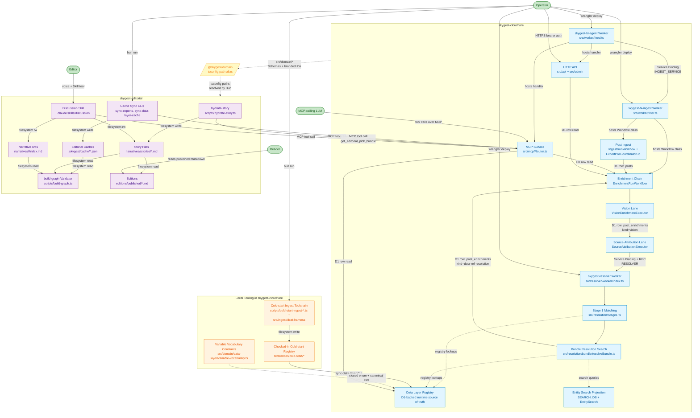

# Skygest System Context

This document maps the current top-level subsystems across `skygest-cloudflare` and `skygest-editorial` after the April 15, 2026 provenance-first resolver cleanup. The live resolver path is now `Stage 1 matching -> asset bundle search` inside the standalone `skygest-resolver` Worker. The facet vocabulary, facet kernel, and generated energy-profile runtime are no longer part of the shipped path. Variable and series semantic resolution are future work.

Effect vocabulary is still load-bearing here: every subsystem name is a Tag, a Workflow class, a Worker name, or a script you can grep for.

## Diagram

## Subsystems

### skygest-cloudflare

**skygest-bi-ingest Worker** (`wrangler.toml`, `src/worker/filter.ts`). The backend Worker that hosts `IngestRunWorkflow`, `EnrichmentRunWorkflow`, the `ExpertPollCoordinatorDo` Durable Object, and the cron sweep that launches ingest. It owns the write-heavy side of the system and the bindings the async workflows need. *Shipped.*

**skygest-bi-agent Worker** (`wrangler.agent.toml`, `src/worker/feed.ts`). The frontend Worker that serves the public/admin HTTP API and the MCP endpoint. It still uses `INGEST_SERVICE` for backend-owned write paths, while keeping its own direct read/admin bindings for the routes declared in `src/worker/feed.ts`. *Shipped.*

**Post Ingest** (`src/ingest/`). Polls tracked experts, writes new posts to D1, and launches enrichment for new material. Exposes `IngestWorkflowLauncher` and `IngestRunWorkflow`; depends on the expert repos, sync-state repos, and Bluesky/Twitter client layers. *Shipped.*

**Enrichment Chain** (`src/enrichment/`). Runs the lane DAG over each post via `EnrichmentRunWorkflow` and `EnrichmentPlanner`. When `ENABLE_DATA_REF_RESOLUTION` is on, the workflow calls the resolver after source attribution and persists a `data-ref-resolution` enrichment row containing `stage1` plus asset-level `resolution` bundles. Legacy `kernel` rows remain readable, but new writes use the new shape only. *Shipped.*

**Vision Lane** (`src/enrichment/vision/`). Calls Gemini to extract chart titles, visible URLs, source lines, logo text, and other media cues. Exposes `VisionEnrichmentExecutor` layered on `GeminiVisionServiceLive`. *Shipped.*

**Source-Attribution Lane** (`src/source/`). Turns vision output plus link context into ranked provider hints against the legacy provider registry. Exposes `SourceAttributionExecutor` layered on `SourceAttributionMatcher` and `ProviderRegistry`. This lane still matters because it feeds the resolver, even though the registry it uses is intentionally frozen for new providers. *Shipped; frozen for new providers.*

**skygest-resolver Worker** (`wrangler.resolver.toml`, `src/resolver-worker/index.ts`). Standalone Worker that exposes the resolver over HTTP and over the `RESOLVER` Service Binding through `ResolverEntrypoint`. It is now part of the shipped runtime, not a planned deployment slice. `src/resolver/Client.ts` is the calling seam used by the ingest and agent workers. *Shipped.*

**Stage 1 Matching** (`src/resolution/Stage1.ts`, `src/resolution/Stage1Resolver.ts`). The deterministic first pass that turns post context, vision output, and source-attribution output into direct matches and typed residuals. It is still the front door to the live resolver and still carries the exact-match and scope-hint work. *Shipped.*

**Bundle Resolution Search** (`src/resolution/bundle/resolveBundle.ts`, `src/resolver/ResolverService.ts`). The authoritative resolver output for the current runtime. It turns each chart asset into an enriched bundle, preserves provenance signals, and resolves agent and dataset candidates through exact URL, hostname, and entity-search lanes. Series and variable arrays are intentionally empty in this slice; semantic resolution is deferred. *Shipped.*

**Data Layer Registry (D1)** (`variables`, `series`, `distributions`, `datasets`, `agents`, `catalogs`, `catalog_records`, `data_services`, `dataset_series`). The runtime source of truth for Stage 1 lookups, exact URL matching, and graph expansion from distribution to dataset and publisher. It is loaded into a prepared lookup contract at Worker cold start and is fed from the checked-in cold-start tree via `scripts/sync-data-layer.ts`. *Shipped.*

**Entity Search Projection** (`SEARCH_DB`, `src/search/*`, `src/services/EntitySearchService.ts`). The lexical and typed-search substrate used by bundle resolution after Stage 1. This is now part of the live resolver path for provenance-first search rather than an optional sidecar. *Shipped.*

**Cold-start Ingest Toolchain** (`scripts/cold-start-ingest-*.ts`, `src/ingest/dcat-harness/`). Local Effect scripts that fetch provider catalog surfaces and project them into checked-in Skygest registry data. The shared harness owns merge rules, slug stability, validation, graph construction, and atomic writes. *Shipped.*

**Checked-in Cold-start Registry** (`references/cold-start/`). Human-reviewed JSON seed state for the data layer. Runtime does not read it directly in production anymore, but it remains the audited source that feeds the D1 registry and local tests. *Shipped.*

**Variable Vocabulary Constants** (`src/domain/data-layer/variable-vocabulary.ts`, `src/domain/data-layer/variable-enums.ts`). Small closed lists such as statistic types, aggregation families, unit families, and canonical concept names that still matter to registry validation and the data-layer spine. These now live in permanent domain code instead of a generated facet profile. *Shipped.*

**MCP Surface** (`src/mcp/Router.ts`, `src/mcp/Toolkit.ts`). Exposes the tool surface used by the discussion workflow and other operator/editor flows. The data-ref resolution rows are already readable through existing read tools such as `get_post_enrichments`, but the dedicated lookup tools `resolve_data_ref` and `find_candidates_by_data_ref` are still not present. *Shipped, with planned data-ref lookup additions.*

**HTTP API Surface** (`src/api/Router.ts`, `src/admin/Router.ts`, plus backend routes mounted under `/admin`). Public reads plus operator writes. Authorized by bearer token on the admin side. *Shipped.*

### skygest-editorial

**hydrate-story** (`scripts/hydrate-story.ts` -> `src/narrative/HydrateStory.ts`). Pulls an `EditorialPickBundle` from staging and writes or refreshes a story scaffold plus per-post annotations. The core scaffold path is shipped; projecting resolver-backed `dataRefs` into story frontmatter is still the open `SKY-242` step. *Shipped core, data-ref projection planned.*

**Cache Sync CLIs** (`scripts/sync-experts.ts`, `scripts/sync-data-layer-cache.ts`). Refresh the local registry mirrors from staging on demand. The data-layer cache substrate is already in place. *Shipped.*

**Editorial Caches** (`.skygest/cache/experts.json`, `variables.json`, `series.json`, `distributions.json`, `datasets.json`, `agents.json`). Read-only local mirrors of the Cloudflare registry. Used by build-graph and the discussion workflow. *Shipped.*

**build-graph Validator** (`scripts/build-graph.ts` -> `src/narrative/BuildGraph.ts`). Validates frontmatter and graph structure across stories, arcs, annotations, and editions. The additional warning pass for unresolved data-layer refs is still open `SKY-243`. *Shipped core, data-layer warning pass planned.*

**Discussion Skill** (`.claude/skills/discussion/SKILL.md`). The editor-facing voice loop. It depends on the MCP read surface, story files, and the editorial scripts. *Shipped.*

**Story Files** (`narratives/<slug>/stories/*.md`). The durable editorial working surface, backed by the shared narrative Schemas. *Shipped.*

**Narrative Arcs** (`narratives/<slug>/index.md`). Parent containers for long-running questions and arc evolution. *Shipped.*

**Editions** (`editions/drafts/*.md`, `editions/published/*.md`). Reader-facing compiled artifacts. The artifact shape exists, but the end-to-end compile loop is still not the center of gravity of current work. *In progress.*

### Cross-repo bridge

**@skygest/domain** (tsconfig `paths` alias, not an npm workspace). `skygest-editorial` imports shared Schemas directly from `../skygest-cloudflare/src/domain/*`. This is still the single load-bearing bridge that keeps the editorial repo and the Cloudflare repo on one set of types. *Shipped.*

## Actors

**Reader** consumes published markdown under `editions/published/`. The artifact is the contract.

**Editor** drives the system through the Discussion Skill, which fans out to MCP read tools, `hydrate-story`, `spawn-arc`, and `build-graph`. The editor does not work by calling raw Worker endpoints directly.

**MCP-calling LLM** is the model inside the discussion workflow and other tool-using flows. The tool surface is its API, which is why structured Schema-backed output matters so much.

**Operator** runs the admin API, sync scripts, cold-start ingest scripts, search projection rebuilds, and `wrangler deploy` against the worker configs. The operator is also the person who can turn the resolver lane on in staging and judge whether the stored outputs are trustworthy enough to move forward.

## Key seams

| Seam | What crosses | Current contract |
|---|---|---|
| `@skygest/domain` bridge | Shared Schemas and branded IDs across both repos | `src/domain/*` imported into `skygest-editorial` via tsconfig `paths` |
| Vision -> Source Attribution | Vision enrichment row written by the vision lane | `VisionEnrichment` in `src/domain/enrichment.ts` |
| Source Attribution -> Resolver | Source-attribution row plus vision/post context | `Stage1Input` assembled from `postContext`, `vision`, `sourceAttribution` |
| Resolver service boundary | Resolver request and response across the `RESOLVER` binding or HTTP | `ResolvePostRequest` / `ResolvePostResponse` in `src/domain/resolution.ts` |
| Resolver -> stored enrichment | Persisted resolver result in `post_enrichments` | `DataRefResolutionEnrichment` in `src/domain/enrichment.ts` with `stage1 + resolution` plus legacy `kernel` read compatibility |
| Registry lookup contract | D1-backed entity lookups used by Stage 1 and bundle resolution | `src/resolution/dataLayerRegistry.ts` |
| Search projection contract | Typed search hits used by bundle resolution | `src/domain/entitySearch.ts`, `src/services/EntitySearchService.ts` |
| Checked-in registry -> D1 registry | Reviewed seed state promoted into runtime tables | `scripts/sync-data-layer.ts`, `src/data-layer/Sync.ts` |
| Variable vocabulary constants | Shared enum and canonical-name lists used by the data-layer spine | `src/domain/data-layer/variable-vocabulary.ts` |
| MCP read path | Tool responses consumed by editorial workflows | `src/mcp/Toolkit.ts` plus response Schemas in `src/domain/*` |
| Editorial cache mirror | Local cached registry manifests | `.skygest/cache/*.json` |
| Story frontmatter | Filesystem contract between scripts, discussion workflow, and validator | `src/domain/narrative/*` |

## Current state

| Subsystem | State |
|---|---|
| Post Ingest, Enrichment Chain, Vision Lane, Source-Attribution Lane | Shipped |
| Resolver Worker + `RESOLVER` Service Binding / `ResolverEntrypoint` RPC | Shipped |
| Stage 1 Matching + Bundle Resolution Search | Shipped |
| Persisted `data-ref-resolution` enrichment row (`stage1 + resolution`, legacy `kernel` rows readable) | Shipped |
| Data Layer Registry (D1), Checked-in Cold-start Registry, sync pipeline | Shipped |
| Entity Search projection and typed search lanes | Shipped |
| Variable/series semantic runtime resolution | Deferred |
| `resolve_data_ref` / `find_candidates_by_data_ref` MCP tools | Planned (`SKY-241`, `SKY-244`) |
| hydrate-story `dataRefs` projection | Planned (`SKY-242`) |
| build-graph unresolved data-ref warnings | Planned (`SKY-243`) |
| LLM follow-up workflow / old Stage 3 story | Not part of the current runtime; future work only |
| Editorial caches, hydrate-story core, build-graph core, discussion workflow, story files, narrative arcs | Shipped |
| Editions compile workflow | In progress |

## What changed in this refresh

1. The resolver is now described as `stage1 + resolution`, not `stage1 + kernel`.
2. The facet vocabulary, facet kernel, and generated energy-profile runtime were removed from the live story.
3. The docs now call out entity search as part of the shipped resolver path.
4. Variable and series semantic resolution are explicitly marked as deferred follow-on work.
5. The remaining product gaps are lookup tools, story projection, and build-graph warnings.
