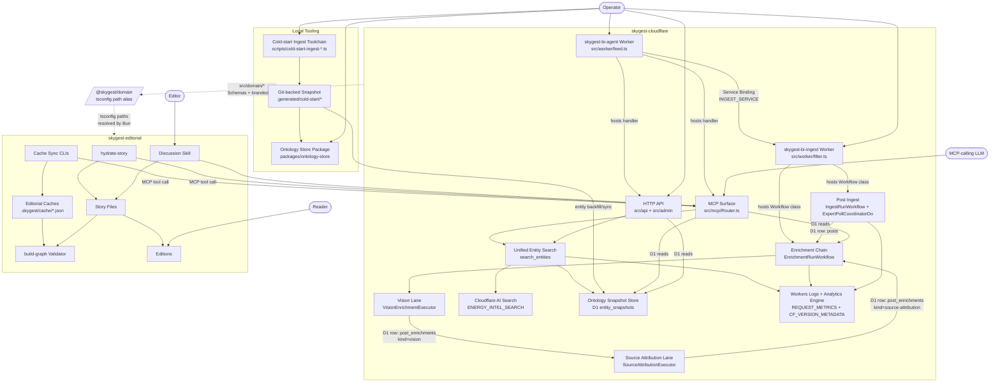

# Skygest System Context

This document maps the current top-level subsystems after the resolver hard cutover. The live backend no longer has a standalone resolver Worker, a `RESOLVER` binding, Stage 1 matching, bundle resolution, or stored `data-ref-resolution` rows.

The current backend shape is:

`ingest -> vision -> source attribution -> entity search`

`search_entities` is the single ontology-aligned search surface. Exact IRI lookup hydrates directly from the D1 ontology snapshot; query search goes through Cloudflare AI Search and hydrates returned IRIs from D1. URL, hostname, alias, local FTS, and custom ranking paths are no longer live surfaces. Linking and edge creation are future workflows, not part of the read/search path.

Effect vocabulary remains load-bearing here: subsystem names map to services, layers, Workflow classes, Worker entry points, or deploy bindings that can be searched in the repo.

## Diagram

## Subsystems

### Cloudflare Workers

**skygest-bi-ingest Worker** (`wrangler.toml`, `src/worker/filter.ts`). Hosts ingest, enrichment, the polling Durable Object, and the backend write routes. It owns the write-heavy workflow path.

**skygest-bi-agent Worker** (`wrangler.agent.toml`, `src/worker/feed.ts`). Serves public/admin HTTP routes and MCP. It uses `INGEST_SERVICE` for backend-owned writes and direct read bindings for search and read surfaces.

There is no active resolver Worker. `wrangler.resolver.toml`, resolver RPC, and the `RESOLVER` service binding were removed in the cutover.

### Runtime Flow

**Post Ingest** (`src/ingest/`). Polls tracked experts, writes posts, and launches enrichment.

**Enrichment Chain** (`src/enrichment/`). Runs vision and source attribution. It no longer calls a resolver and no longer writes `data-ref-resolution`.

**Vision Lane** (`src/enrichment/vision/`). Extracts chart/media cues, visible URLs, source lines, titles, and other evidence from post media.

**Source Attribution Lane** (`src/source/`). Produces publisher/source hints. It remains useful extraction output, but it is not a resolver handoff anymore.

**Unified Entity Search** (`src/services/SearchEntitiesService.ts`, `src/services/OntologyEntityHydrator.ts`, `src/domain/entitySearch.ts`). The canonical search surface. It accepts exactly one of `query` or `iri`, records per-request metrics, and returns hydrated ontology hits. Exact IRI lookup bypasses AI Search. Query lookup uses Cloudflare AI Search hybrid retrieval and preserves Cloudflare ordering after D1 hydration.

**AI Search Index** (`ENERGY_INTEL_SEARCH`). Owns fuzzy recall and ranking for query search. The Worker sends ontology entity-type metadata filters and does not run a second local ranking layer.

**Ontology Snapshot Store** (`packages/ontology-store`, D1 `entity_snapshots`). The hydration source of truth for returned search payloads. AI Search results that cannot be decoded or hydrated are dropped and counted.

**Observability** (`src/platform/Observability.ts`). Workers Logs are enabled. Analytics Engine records one search datapoint per `search_entities` request, and `CF_VERSION_METADATA` tags logs/metrics with deploy version metadata.

### Tooling

**Cold-start Ingest Toolchain** (`scripts/cold-start-ingest-*.ts`, `src/ingest/dcat-harness/`). Fetches catalog surfaces and projects them into the repo-local snapshot.

**Git-backed Snapshot** (`.generated/cold-start/`). The local source that feeds D1 sync/backfill, tests, and ontology-store validation.

**Ontology Store Package** (`packages/ontology-store/`). Offline RDF emit, SHACL validation, reload, and distill tooling. It stays off the Worker hot path.

### Editorial Bridge

**MCP Surface** (`src/mcp/Router.ts`, `src/mcp/Toolkit.ts`). Exposes post reads, editorial bundles, pipeline status, and entity search. Old data-ref lookup tools are gone; future linking/search tools should build on `search_entities`.

**@skygest/domain** is still the shared schema bridge into `skygest-editorial` via tsconfig path aliases.

## Key Seams

| Seam | What crosses | Current contract |
|---|---|---|
| Worker deploy config | Cloudflare bindings and deploy targets | `wrangler.toml`, `wrangler.agent.toml` only |
| Ingest -> Enrichment | Post rows and workflow params | `IngestRunParams`, `EnrichmentRunParams` |
| Vision -> Source Attribution | Vision extraction payload | `VisionEnrichment` |
| Source Attribution -> Reads/Search | Publisher/source extraction payload | `SourceAttributionEnrichment` |
| Entity search request | Query text or exact ontology IRI | `SearchEntitiesRequest` |
| Entity search response | Hydrated ontology hits | `SearchEntitiesResponse` |
| AI Search recall/ranking | Query candidates before hydration | `ENERGY_INTEL_SEARCH` |
| Ontology hydration | Branded IRI decode and snapshot load | `OntologyEntityHydrator` |
| Observability | Request metrics and deploy tags | `REQUEST_METRICS`, `CF_VERSION_METADATA` |
| Editorial bridge | Shared schemas into editorial repo | `@skygest/domain/*` |

## Current State

| Subsystem | State |
|---|---|
| Post ingest, enrichment, vision, source attribution | Shipped |
| Resolver Worker, resolver RPC, `RESOLVER` binding | Removed |
| Stored `data-ref-resolution` enrichment rows | Removed from live contract |
| Unified `search_entities` surface | Shipped |
| Cloudflare AI Search recall/ranking binding | Shipped |
| D1 ontology snapshot hydration | Shipped |
| Search observability via Workers Logs and Analytics Engine | Shipped |
| Data-layer registry and sync pipeline | Shipped |
| Ontology-store validation/export tooling | Shipped as offline tooling |
| Link-writing workflows / edge creation | Future work |
