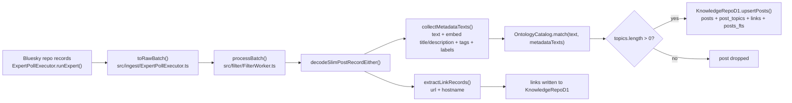
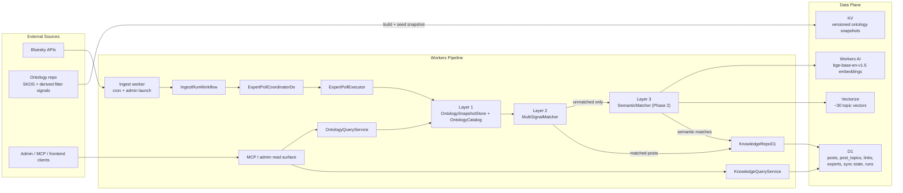
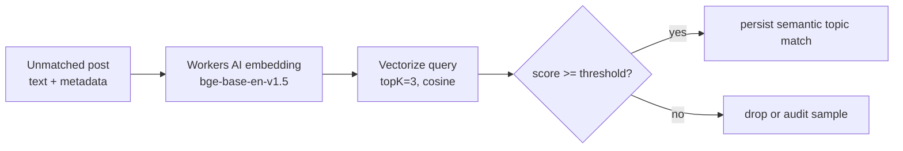

# Ontology Layer Architecture Proposal

**Date:** 2026-03-11
**Status:** Phase 1 complete (2026-03-12). Phase 2 deferred.
**Scope:** Skygest energy-news data layer only; frontend is out of scope, but the design is optimized for frontend and agent retrieval.

### Implementation Status

| Phase | Status | Date |
|---|---|---|
| Phase 0: Snapshot compiler and signal normalization | **Complete** | 2026-03-11 |
| Phase 1a: KV-backed ontology store + multi-signal matcher | **Complete** | 2026-03-12 |
| Phase 1b: Agent retrieval surface via MCP | **Complete** | 2026-03-12 |
| Phase 1c: D1 provenance migration (`post_topic_match_provenance`) | **Complete** | 2026-03-12 |
| KV staging verification | **Complete** | 2026-03-12 |
| Phase 2: Semantic fallback (Vectorize + Workers AI) | Deferred | — |

**KV namespace:** `f9888501c4ad473db8ff49ecf069f9ed` (bound as `ONTOLOGY_KV` in both `wrangler.toml` and `wrangler.agent.toml`).
**Staging D1:** All 6 migrations applied, including `post_topic_match_provenance` (migration 6) with `match_signal`, `match_value`, `match_score`, `ontology_version`, `matcher_version` columns on `post_topics`.
**Legacy cleanup:** `config/ontology/energy-topics.json` removed; all terms merged into `canonical.ts` term overrides and `legacyTopicCompatibility`.

---

## 1. Problem Statement

Skygest already has a working ingest pipeline, but topic assignment is still materially narrower than the ontology and curation assets available to the project.

The current implementation:

- fetches and decodes Bluesky post records
- extracts free-text metadata and links
- runs a static substring matcher over a bundled 15-topic JSON file
- drops any post that does not match at least one topic
- stores only the matched posts in D1

That path is functional, but it leaves three major gaps:

1. **Ontology under-utilization.** The checked-in runtime catalog has **15 topics / 96 terms** (`config/ontology/energy-topics.json`), while the formal ontology repo contains **92 SKOS concepts** split into **23 top concepts and 69 narrower concepts** in `energy-news-reference-individuals.ttl`.
2. **Signal collapse.** The runtime already extracts hashtags and link domains, but the matcher only uses a normalized text haystack. Hashtags are folded into generic metadata text, and link domains are stored but never used for topic assignment.
3. **Retrieval gap for agents and the future frontend.** Agents can query stored posts, links, and experts, but they cannot deterministically inspect the ontology itself: no topic hierarchy, no signal inventory, no topic expansion, and no provenance explaining why a post matched.

### Current Matching Flow



### Source References

- Current batch entrypoint: `src/filter/FilterWorker.ts:35-121`
- Single-expert ingest and raw-batch construction: `src/ingest/ExpertPollExecutor.ts:134-145`, `src/ingest/ExpertPollExecutor.ts:214-260`
- Static catalog load and substring matching: `src/services/OntologyCatalog.ts:33-68`
- Post decode, tag extraction, link hostname extraction, metadata collection: `src/bluesky/PostRecord.ts:63-173`
- Topic schemas: `src/domain/bi.ts:69-103`
- Current runtime topic file: `config/ontology/energy-topics.json:1-77`

---

## 2. Current Baseline and Retrieval Gap

The proposal should be grounded in the live code and the current staging database, not only in the ontology repo.

### What the code does today

- `OntologyCatalog.layer` synchronously imports `config/ontology/energy-topics.json` and prepares normalized term arrays in-process.
- `OntologyCatalog.match()` lowercases and strips punctuation, then runs `haystack.includes(normalizedTerm)` for each topic term.
- `collectMetadataTexts()` already appends `record.tags` and `label_values` into the generic metadata haystack, which means hashtags influence matching, but only as text, not as a first-class exact signal.
- `extractLinkRecords()` already computes `LinkRecord.domain`, but `FilterWorker` never passes domains into the matcher.
- `processBatch()` drops unmatched posts before they reach D1.

### What agents can query today

The query side is D1-centric:

- `KnowledgeQueryService` exposes `searchPosts`, `getRecentPosts`, `getPostLinks`, and `listExperts` from D1 (`src/services/KnowledgeQueryService.ts:17-78`).
- `KnowledgeMcpToolkit` exposes exactly those four tools (`src/mcp/Toolkit.ts:23-103`).
- `src/mcp/Router.ts:15-35` already wires `OntologyCatalog.layer` into the query layer, but no read-only ontology tools consume it.

That means the system can answer:

- "Find posts about solar"
- "List recent posts from expert X"
- "Show links for domain Y"

But it cannot answer:

- "What topics exist in the ontology?"
- "What child concepts roll up into `grid-and-infrastructure`?"
- "Which hashtags or domains are attached to `offshore-wind`?"
- "Why did this post match `energy-policy`?"

For a frontend facet system and agentic retrieval, that is the core missing layer.

---

## 3. Design Goals

1. **Deterministic classification.** Topic assignment must remain explainable, inspectable, and debuggable. A post should always be classifiable back to explicit ontology evidence.
2. **Ontology as data, not code.** Topic structure and matching signals should evolve without requiring a Worker redeploy.
3. **Separation of concerns.** Snapshot loading, ontology browsing, deterministic matching, semantic fallback, and D1 persistence should be separate Effect services.
4. **Agent-ready retrieval.** Agents and the future frontend need both the post corpus and the ontology graph, not just D1 search.
5. **Operational safety.** Runtime behavior must degrade cleanly if KV or Vectorize is unavailable.
6. **Minimal platform surface area.** Prefer Cloudflare-native primitives already aligned with the current architecture: Workers, KV, D1, Vectorize, Workers AI, Workflows, and Durable Objects.

---

## 4. Proposed Three-Layer Architecture

The proposed data layer keeps the current ingest orchestration intact and introduces a clean separation between ontology state, deterministic classification, and semantic recall.



### Architectural Decisions

- **Layer 1** is the runtime ontology source of truth: a compiled, versioned snapshot loaded from KV with a bundled static fallback.
- **Layer 2** is the primary classifier: deterministic, multi-signal, and provenance-preserving.
- **Layer 3** is a strictly bounded fallback: only invoked for posts that Layer 2 does not classify.
- **Query consumers** read through two services:
  - `KnowledgeQueryService` for posts, links, and experts in D1
  - `OntologyQueryService` for topic structure, aliases, signals, and rollups from the in-memory ontology catalog

The key improvement is not only a better classifier; it is an ontology-aware read path for the frontend and agents.

---

## 5. Layer 1: KV-Backed Ontology Store

### Why KV is the right runtime store

Cloudflare positions Workers KV for **configuration data** and **read-heavy, globally distributed lookups**, while D1 is the relational option for strongly consistent SQL workloads.[Cloudflare Storage Options](https://developers.cloudflare.com/workers/platform/storage-options/) KV is eventually consistent and optimized for frequent reads with relatively infrequent writes.[Cloudflare KV: How KV works](https://developers.cloudflare.com/kv/concepts/how-kv-works/)

That fits the ontology snapshot exactly:

- tiny relative to KV value limits
- updated infrequently
- identical for all requests
- read on every ingest and ontology-query request

### Snapshot, not per-topic keys

Use the coalesced-key pattern, not one key per topic:

```text
ontology:energy:active      -> "v4"
ontology:energy:v4          -> { ...OntologySnapshot... }
ontology:energy:v3          -> { ...OntologySnapshot... }
```

This follows Cloudflare guidance to read related values together rather than fan out many cold KV reads.[Cloudflare KV read patterns](https://developers.cloudflare.com/kv/api/read-key-value-pairs/)

Relevant KV constraints from the docs:

- eventually consistent globally, with writes typically visible worldwide within about 60 seconds[Cloudflare KV: How KV works](https://developers.cloudflare.com/kv/concepts/how-kv-works/)
- values up to 25 MiB[Cloudflare KV limits](https://developers.cloudflare.com/kv/platform/limits/)
- bulk read support up to 100 keys per call[Cloudflare KV read patterns](https://developers.cloudflare.com/kv/api/read-key-value-pairs/)

The runtime ontology is well below those limits even after expansion.

### Recommended runtime split

Separate runtime responsibilities into two services:

```ts
export class OntologySnapshotStore extends Context.Tag("@skygest/OntologySnapshotStore")<
  OntologySnapshotStore,
  {
    readonly getActiveSnapshot: () => Effect.Effect<OntologySnapshot>;
  }
>() {}

export class OntologyCatalog extends Context.Tag("@skygest/OntologyCatalog")<
  OntologyCatalog,
  {
    readonly version: number;
    readonly topics: ReadonlyArray<OntologyTopicV2>;
    readonly getTopic: (slug: TopicSlug) => Effect.Effect<OntologyTopicV2 | null>;
    readonly listTopics: () => Effect.Effect<ReadonlyArray<OntologyTopicV2>>;
    readonly expandTopic: (slug: TopicSlug) => Effect.Effect<ReadonlyArray<TopicSlug>>;
  }
>() {}
```

`OntologySnapshotStore` owns I/O and fallback logic. `OntologyCatalog` owns prepared in-memory structures and browse operations. This keeps matching and query layers independent from KV mechanics.

### Snapshot shape

```ts
const OntologyTopicV2 = Schema.Struct({
  slug: TopicSlug,
  label: Schema.String,
  parent: Schema.optional(TopicSlug),
  children: Schema.optional(Schema.Array(TopicSlug)),
  terms: Schema.Array(Schema.String),
  hashtags: Schema.Array(Schema.String),
  domains: Schema.Array(Schema.String),
  conceptIds: Schema.Array(Schema.String),
  scopeNote: Schema.optional(Schema.String)
});

const OntologySnapshot = Schema.Struct({
  domain: Schema.String,
  version: Schema.Number,
  generatedAt: Schema.String,
  sourceRefs: Schema.Array(Schema.String),
  topics: Schema.Array(OntologyTopicV2),
  authorTiers: Schema.optional(
    Schema.Struct({
      energyFocused: Schema.Array(Schema.String),
      generalOutlets: Schema.Array(Schema.String)
    })
  )
});
```

### Build-time recommendation

Do **not** hand-maintain a 30-topic JSON file indefinitely. Instead:

1. compile a canonical `OntologySnapshot` from the ontology repo and normalized signal inputs
2. check the compiled JSON into `config/ontology/` as the static fallback
3. upload the same JSON to KV as the active snapshot

That makes the bundled file and the KV snapshot identical by construction.

---

## 6. Layer 2: Deterministic Multi-Signal Matcher

### What changes

The matcher should consume four explicit inputs:

- `text`
- `metadataTexts`
- `hashtags`
- `linkDomains`

Today, `tags` are only present as free text in `collectMetadataTexts()`, and domains are ignored by the matcher. The new design promotes both to first-class signals.

### Matching rules

Use a deterministic evidence model rather than a single untyped `matchedTerm` string:

```ts
const MatchSignal = Schema.Literal("term", "hashtag", "domain", "semantic");

const TopicEvidence = Schema.Struct({
  signal: MatchSignal,
  value: Schema.String,
  weight: Schema.Number
});

const MatchedTopicV2 = Schema.Struct({
  topicSlug: TopicSlug,
  matchedTerm: Schema.String,
  matchSignal: MatchSignal,
  matchScore: Schema.Number,
  ontologyVersion: Schema.Number
});
```

### Runtime algorithm

1. Build a normalized text haystack from `text + metadataTexts`.
2. Normalize hashtags by stripping `#` and lowercasing.
3. Normalize domains to lowercased hostnames.
4. For each topic:
   - collect all matching evidence
   - select the strongest evidence as the persisted primary match
   - preserve deterministic score and ontology version

Suggested weights:

| Signal | Weight | Reason |
|---|---:|---|
| domain | 4 | strongest source-specific evidence |
| hashtag | 3 | explicit topical intent |
| multi-word term | 2 | precise lexical evidence |
| curated single-word term | 1 | useful but most ambiguous |

Suggested acceptance rule:

- accept any topic with a score >= 2
- accept score 1 only if the matched term is not on the ambiguity list

### Why keep score and signal provenance

The current design returns only `{ topicSlug, matchedTerm }`. That is too lossy for:

- explaining matches to agents
- frontend topic badges or filters
- debugging false positives
- evaluating whether semantic fallback is actually needed

### Minimal D1 persistence change

The cleanest implementation is a small `post_topics` migration:

```sql
ALTER TABLE post_topics ADD COLUMN match_signal TEXT NOT NULL DEFAULT 'term';
ALTER TABLE post_topics ADD COLUMN match_score REAL;
ALTER TABLE post_topics ADD COLUMN ontology_version INTEGER;
```

This is worth doing. Encoding provenance into `matched_term` would save one migration, but it would permanently weaken explainability and query ergonomics.

### Unmatched-post instrumentation

Today unmatched posts are dropped immediately. To evaluate Layer 2 quality and decide whether Layer 3 is necessary, the system should record:

- unmatched post count per run item
- counts by signal type
- a small sampled set of unmatched examples for manual review

This can be done without storing every unmatched post. A sampled audit log or sampled run-item metadata is sufficient.

---

## 7. Topic Expansion: 15 Runtime Topics to ~30 Canonical Topics

### Current runtime inventory

- `config/ontology/energy-topics.json` contains **15 topics / 96 terms**
- the matcher today is term-only

### Formal ontology and curated signal inventory

From the ontology repo:

- **92 SKOS concepts** in `energy-news-reference-individuals.ttl`
- **23 top concepts**
- **69 narrower concepts**
- **184 topic labels / altLabels** across the scheme

From the derived filter document:

- **74 energy-focused authors**
- **34 curated link domains**
- a heading that says **82 hashtags**, but the currently checked-in code block enumerates **85 unique hashtags**

That last point is important. The runtime compiler must canonicalize the curated hashtag list before snapshot generation; otherwise the runtime inventory will drift from the source docs.

### Canonical topic model

The frontend and agents do not need to expose all 92 SKOS concepts as top-level facets. The right move is a **canonical topic layer of about 30 slugs** that preserves user-facing distinctions while rolling the rest into aliases or child concepts.

Recommended canonical topic set:

| Group | Canonical topics |
|---|---|
| Generation | `solar`, `wind`, `offshore-wind`, `geothermal`, `hydro`, `biomass`, `nuclear`, `hydrogen`, `natural-gas`, `coal`, `oil` |
| Grid and demand | `energy-storage`, `distributed-energy`, `grid-and-infrastructure`, `electrification`, `energy-efficiency`, `data-center-demand` |
| Markets and policy | `energy-policy`, `energy-markets`, `energy-finance`, `energy-geopolitics`, `critical-minerals` |
| Climate and transition | `climate-and-emissions`, `carbon-capture`, `carbon-markets`, `environment-and-land-use`, `energy-justice`, `sectoral-decarbonization`, `workforce-and-manufacturing`, `research-and-innovation` |

### Rollup rule

Preserve a narrower concept as its own canonical slug only when at least one of these is true:

1. it has meaningful user-facing query intent on its own
2. it has dedicated hashtags or domains
3. it maps to a distinct editorial beat
4. it improves retrieval precision materially

Otherwise, store it as:

- a child concept in the ontology graph
- an alias term in the parent topic
- a signal source for the parent topic

### Recommendation

Treat the 92-concept ontology as the **structural source of truth**, and the ~30-topic canonical set as the **application-facing retrieval shape**.

---

## 8. Layer 3: Semantic Matcher (Vectorize + Workers AI, Phase 2)

### When to add it

Do not lead with semantic classification. Ship the deterministic multi-signal layer first, then evaluate:

- unmatched rate
- sampled unmatched examples
- false-negative rate by topic

Only if those metrics justify it should the system invoke semantic fallback inline.

### Recommended semantic design

- model: `@cf/baai/bge-base-en-v1.5`
- vector size: **768 dimensions**
- max input tokens: **512**
- index metric: **cosine**
- stored vectors: **~30 canonical topic vectors**

Cloudflare’s Workers AI model catalog lists `@cf/baai/bge-base-en-v1.5` as a 768-dimension text-embedding model with 512-token context.[Workers AI model catalog](https://developers.cloudflare.com/workers-ai/models/#text-embeddings)

### Query path



Suggested runtime guardrails:

- only invoke Layer 3 if Layer 2 returns zero topics
- query `topK = 3`
- start with `score >= 0.75`
- never overwrite a deterministic match with a semantic one

### Cost projection

Two useful projections:

1. **Observed staging rate**
   - last 30 days: 3,583 active posts
   - if 30% require semantic fallback: ~1,075 embeddings/month
   - at 50 input tokens each and Workers AI pricing of **$0.067 / million input tokens** for `bge-base-en-v1.5`, embedding cost is effectively negligible.[Workers AI pricing](https://developers.cloudflare.com/workers-ai/platform/pricing/)

2. **Conservative future rate**
   - 100,000 posts/month
   - 30% semantic fallback rate
   - 30,000 embeddings x 50 tokens = 1.5M input tokens
   - Workers AI cost: about **$0.10 / month**

For Vectorize, a 30-topic x 768-dimension index is tiny, and 30,000 monthly queries is still inside the included queried-dimension allowance on the current pricing page.[Vectorize pricing](https://developers.cloudflare.com/vectorize/platform/pricing/)

**Conclusion:** even at the conservative future rate, Layer 3 stays well under **$1 / month**.

---

## 9. Storage, Provenance, and D1 Limits

### Storage ownership

| Store | Role |
|---|---|
| D1 | system of record for posts, links, topic assignments, experts, sync state, ingest runs |
| KV | immutable ontology snapshots + active version pointer |
| Vectorize | tiny semantic topic index |
| Workers AI | on-demand embedding generation only |

### What should remain in D1

Keep post data in D1 because the query surface depends on:

- relational joins (`posts` + `experts` + `post_topics`)
- full-text search (`posts_fts`)
- time ordering
- link filtering
- topic filtering

KV should never become the post store.

### Recommended provenance additions

To support deterministic retrieval and debugging:

- `post_topics.match_signal`
- `post_topics.match_score`
- `post_topics.ontology_version`
- `ingest_runs.ontology_version`
- signal counts on run summaries or sampled audit rows

### Current staging D1 baseline

Observed on 2026-03-12 via remote `wrangler d1 execute` against `skygest-staging`:

- **18,169** rows in `posts`
- **18,103** rows in `post_topics`
- **8,697** rows in `links`
- **150** active experts
- database size after query: **41,775,104 bytes** (~39.8 MiB)
- active-post date span: **2022-01-19** to **2026-03-12**
- active posts in the last 30 days: **3,583**

### D1 runway

Using the observed staging size and post volume:

- average footprint: about **2.3 KB per stored post** including indexes and related rows
- observed last-30-day growth: about **7.9 MiB / month**
- D1 per-database size limit: **10 GB**[Cloudflare D1 limits](https://developers.cloudflare.com/d1/platform/limits/)

That yields roughly **109 years** of runway at the current observed 30-day pace. Even if we apply a blunt **2x safety factor** for new provenance columns, index growth, and temporary overrun, the effective runway is still about **54-55 years**.

This makes the D1 question straightforward:

- D1 is not the bottleneck for this architecture
- there is no reason to move posts or query results out of D1
- ontology externalization to KV is a performance and operability decision, not a D1 capacity workaround

---

## 10. Effect Service Architecture

### Current ingest-side layer graph

```text
CloudflareEnv
  -> OntologyCatalog.layer (static JSON, sync)
  -> KnowledgeRepoD1.layer
  -> ExpertPollExecutor.layer
  -> FilterWorker.processBatch()
```

Concrete references:

- layer assembly: `src/ingest/Router.ts:91-151`
- static ontology service: `src/services/OntologyCatalog.ts:23-71`
- ingest worker entry: `src/worker/filter.ts:22-45`

### Current query-side layer graph

```text
CloudflareEnv
  -> OntologyCatalog.layer
  -> ExpertsRepoD1.layer
  -> KnowledgeRepoD1.layer
  -> KnowledgeQueryService.layer
  -> MCP toolkit
```

Concrete references:

- query layer wiring: `src/mcp/Router.ts:15-35`
- MCP tools: `src/mcp/Toolkit.ts:23-103`

### Proposed service split

```text
CloudflareEnv (+ ONTOLOGY_KV)
  -> OntologySnapshotStore
  -> OntologyCatalog
  -> MultiSignalMatcher
  -> KnowledgeRepoD1
  -> KnowledgeQueryService
  -> OntologyQueryService
  -> MCP / admin read surface
  -> optional SemanticMatcher (+ VECTORIZE + AI)
```

### Proposed interfaces

Recommended services:

- `OntologySnapshotStore`
- `OntologyCatalog`
- `MultiSignalMatcher`
- `OntologyQueryService`
- `SemanticMatcher` (Phase 2)

Why split `OntologyCatalog`?

- load/fallback logic and match logic have different failure modes
- query consumers need browse operations that the matcher does not
- isolate-local prepared indexes should be built once per active snapshot version

### Query-surface recommendation

Add read-only ontology tools alongside the existing post tools:

- `list_topics`
- `get_topic`
- `expand_topic`
- `list_topic_signals`

That gives agents deterministic access to the ontology graph and lets the frontend hydrate filters and topic pages without re-encoding ontology knowledge elsewhere.

---

## 11. Phased Implementation Plan

### Phase 0: Snapshot compiler and signal normalization — COMPLETE

Goal: turn the ontology repo into a clean machine-readable runtime artifact.

Tasks:

- create `scripts/build-ontology-snapshot.ts`
- compile from:
  - `energy-news-reference-individuals.ttl` or `release/energy-news.json`
  - normalized curated signal inputs
- emit:
  - `config/ontology/energy-snapshot.json`
  - optional validation report with counts and diffs
- resolve the current hashtag discrepancy (`82` in heading vs `85` listed entries)

Files:

- `scripts/build-ontology-snapshot.ts` (new)
- `config/ontology/energy-snapshot.json` (new)
- `tests/ontology.test.ts`
- new `tests/ontology-snapshot.test.ts`

### Phase 1: Runtime ontology store + deterministic matcher — COMPLETE

Goal: ship the core architecture without semantic fallback.

Tasks:

- add ontology snapshot schemas and provenance enums to `src/domain/bi.ts`
- add `OntologySnapshotStore`
- refactor `OntologyCatalog` into browse-only prepared catalog operations
- add `MultiSignalMatcher`
- update `FilterWorker.processBatch()` to pass:
  - text
  - metadata
  - hashtags
  - link domains
- add KV binding in:
  - `src/platform/Env.ts`
  - `wrangler.toml`
  - `wrangler.agent.toml`
- add `scripts/seed-ontology-kv.ts`

Files:

- `src/domain/bi.ts`
- `src/services/OntologySnapshotStore.ts` (new)
- `src/services/OntologyCatalog.ts`
- `src/services/MultiSignalMatcher.ts` (new)
- `src/filter/FilterWorker.ts`
- `src/platform/Env.ts`
- `wrangler.toml`
- `wrangler.agent.toml`
- `scripts/seed-ontology-kv.ts` (new)

### Phase 1b: Agent/frontend retrieval surface — COMPLETE

Goal: expose the ontology as a deterministic read model.

Tasks:

- add `OntologyQueryService`
- add read-only MCP tools for topic listing, topic expansion, and signal inspection
- expose canonical topic rollups for query planning

Files:

- `src/services/OntologyQueryService.ts` (new)
- `src/mcp/Toolkit.ts`
- `src/mcp/Router.ts`
- `tests/mcp.test.ts`

### Phase 1c: Provenance and observability — COMPLETE

Goal: make the classifier explainable and measurable.

Tasks:

- add `post_topics.match_signal`
- add `post_topics.match_score`
- add `post_topics.ontology_version`
- add unmatched and per-signal counters to run metrics or sampled audit storage

Files:

- `src/db/migrations.ts`
- `src/services/d1/KnowledgeRepoD1.ts`
- `src/services/d1/IngestRunsRepoD1.ts`
- `src/services/d1/IngestRunItemsRepoD1.ts`

### Phase 2: Semantic fallback — DEFERRED

Goal: recover high-value false negatives without weakening deterministic behavior.

Tasks:

- create Vectorize index
- add `AI` and `VECTORIZE` bindings
- add `SemanticMatcher`
- create `scripts/seed-topic-embeddings.ts`
- invoke semantic matcher only for posts with zero deterministic matches

Files:

- `src/services/SemanticMatcher.ts` (new)
- `src/filter/FilterWorker.ts`
- `src/platform/Env.ts`
- `wrangler.toml`
- `wrangler.agent.toml`
- `scripts/seed-topic-embeddings.ts` (new)
- `tests/semantic-matcher.test.ts` (new)

### What does not need to change

These components can stay structurally intact:

- `IngestRunWorkflow`
- `ExpertPollCoordinatorDo`
- `BlueskyClient`
- `RepoRecordsClient`
- the overall D1 post/query model

The architecture change is concentrated in the ontology and retrieval layers, not in workflow orchestration.

---

## 12. Risk Assessment, Open Questions, and References

### Risk assessment

| Risk | Likelihood | Impact | Mitigation |
|---|---|---|---|
| Curated signal inventory drifts from source docs | Medium | Medium | Normalize signals in a compiler step and unit-test counts before KV seeding |
| KV returns stale snapshot during rollout | Low | Low | Use immutable versioned keys plus one active pointer; keep static fallback bundled |
| Provenance is lost if schema is not updated | High | Medium | Add explicit provenance columns instead of packing signal info into `matched_term` |
| Semantic fallback increases latency | Low | Low | Invoke only on deterministic misses; gate behind metrics |
| False negatives remain invisible because unmatched posts are dropped | High | Medium | Add unmatched counts plus sampled audit logging before Phase 2 |
| External ontology repo path is brittle in CI | Medium | Medium | Compile a checked-in snapshot artifact inside this repo; runtime never depends on the external repo path |

### Open questions

1. **What is the authoritative machine-readable source for curated hashtags, domains, and author tiers?**  
   The current ontology repo has good documents, but not yet a clean single JSON artifact for all signal classes.

2. **Should energy-focused-author pass-through be part of Skygest ingest now, or only if the ingest surface broadens beyond curated experts?**  
   For the current expert-only ingest, it is likely metadata rather than a primary filter.

3. **Do we want exactly ~30 canonical topics fixed in the application layer, or do we want the frontend to optionally surface selected child concepts directly?**  
   The architecture supports either, but the UI contract should be explicit before we seed production snapshots.

### References

#### Codebase

- `src/filter/FilterWorker.ts:35-121`
- `src/ingest/ExpertPollExecutor.ts:134-145`
- `src/ingest/ExpertPollExecutor.ts:214-260`
- `src/services/OntologyCatalog.ts:23-71`
- `src/bluesky/PostRecord.ts:63-173`
- `src/services/KnowledgeQueryService.ts:17-78`
- `src/mcp/Router.ts:15-35`
- `src/mcp/Toolkit.ts:23-103`
- `src/services/d1/KnowledgeRepoD1.ts:368-543`
- `src/db/migrations.ts:7-210`
- `docs/architecture/2026-03-09-current-system-architecture.md`

#### Ontology repo

- `/Users/pooks/Dev/ontology_skill/ontologies/energy-news/energy-news-reference-individuals.ttl`
- `/Users/pooks/Dev/ontology_skill/ontologies/energy-news/release/energy-news.json`
- `/Users/pooks/Dev/ontology_skill/ontologies/energy-news/docs/derived-store-filter.md`
- `/Users/pooks/Dev/ontology_skill/ontologies/energy-news/scripts/ingest/topics.py`

#### Cloudflare docs

- [Cloudflare Storage Options](https://developers.cloudflare.com/workers/platform/storage-options/)
- [Workers KV: How KV works](https://developers.cloudflare.com/kv/concepts/how-kv-works/)
- [Workers KV read patterns](https://developers.cloudflare.com/kv/api/read-key-value-pairs/)
- [Workers KV limits](https://developers.cloudflare.com/kv/platform/limits/)
- [D1 limits](https://developers.cloudflare.com/d1/platform/limits/)
- [Vectorize pricing](https://developers.cloudflare.com/vectorize/platform/pricing/)
- [Workers AI pricing](https://developers.cloudflare.com/workers-ai/platform/pricing/)
- [Workers AI model catalog: text embeddings](https://developers.cloudflare.com/workers-ai/models/#text-embeddings)
